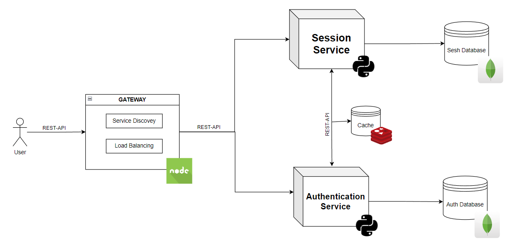

# Dungeons and Dragons online platform :dragon_face:
#### made by Vlad Ursu,  FAF-212

<br>

## Intro
D&D has been a window into social interactions for many a nerd since the distant ages of the 1970s, and now using the tools invented by the very same nerds, the D&D experience can expand far beyond a single physical tabletop.

With the arcane arts of microservices, we can create a scalable, easily maintainable, and fault-tolerant online platform, bringing a new dimension to the classic game.

## Assesing suitability
1. **Modular game logic:** The whole D&D game process is already modularized, as it easily separates between: Game Master and the Players themselves, thus creating a service to handle each part of the game is a logical follow-up.

2. **Scalability:** Part of the game such as campaign making, character creation/registration, or ongoing matches may have different loads. Microservices would make possible scaling each component independetly, thus  assuring an optimal resource allocation.

3. **Resilience:** If one service, or instance of a service goes down, the game will not be affected, and the problem will be dealt with quetly, minimizing any disruptions.

4. **Easily updated/expanded:** It is easier to implement new features (such as rules, or creatures, or a whole new edition of D&D) in a microservice architecture.

## Similar products
- **Twitch**

Twitch employs microservices to handle their live-streaming, live chat, and user profiles. Somewhat similar, the D&D platform would have need of real-time game sessions, and asynchronous interactions.

- **EVE Online**

EVE uses a microservice architecture to handle a much more complex product (the in-game economy, combat, exploration and ship customization). Something such as the D&D platform, a lot simpler in it's scope could well take after some of EVE's aspects.

- **Steam**

Amongst other things, Steam's microservices facilitate multiplayer game hosting, which due to them being decoupled allow for better scaling and reliability. The D&D platform could make use of a likewise structure for managing multiplayer games independently from other services.

## Service Boundaries
The two services in this architecture can be defined as such: 
- **Game Master Service**

This service would be responsible for any actions controlled by the GM (game session management, player interaction, NPCs, combat, player communication) 

- **Player Service**

This service will be responsible for character actions, character creations, character rolls and communication with the GM and other players.



## Technology stack & Communication Patterns

- Python (Flask) - for writing the 2 services.
- Node.js - for the Gateway, the Service Discovery and Load Balancing.
- MongoDB - for the service databases.
- Redis - for the shared service cache.

The microservices are communicating between themselves synchronously using REST-APIs, and asynchronously when it comes to caching in the redis db, and load balancing.

Additionally the user will employ websockets for real time communication.

## Data Management

### GM API Endpoints

- ```(POST) api/GM/register```: used for registering a new GM, and creating a new campaign.

```
request:
{
  "gm_name": "string",
  "email": "string",
  "password": "string",
  "campaign_name": "string",
  "description": "string"
}
response:
{
  "gm_id": "string",
  "campaign_id": "string",
  "message": "Campaign created successfully."
}
```

---

- ```(POST) api/GM/create-session```: Create a new game session.

```
request:
{
  "campaign_id": "string",
  "session_name": "string",
  "start_time": "datetime"
}
response:
{
  "session_id": "string",
  "message": "Session created successfully."
}
```

---

- ```(POST) api/GM/createNPC```: Create a new non-playable character.

```
request:
{
  "campaign_id": "string",
  "npc_name": "string",
  "npc_stats": {
    "strength": "int",
    "dexterity": "int",
    "intelligence": "int",
    "charisma": "int"
  }
}
response:
{
  "npc_id": "string",
  "message": "NPC created successfully."
}
```

---

- ```(POST) api/GM/combat```: Manage combat.

```
request:
{
  "session_id": "string",
  "participants": [
    {
      "name": "string",
      "type": "player | npc",
      "current_hp": "int",
      "action": "string"
    }
  ]
}
response:
{
  "combat_status": "string",
  "message": "Combat managed successfully."
}
```

---

- ```(POST,GET) api/GM/message-player```: Send and receive text messages with players.

```
request:
{
  "session_id": "string",
  "player_id": "string",
  "message": "string"
}
response:
{
  "timestamp": "datetime",
  "message": "Message sent/received."
}
```

---

- ```(POST) api/GM/roll```: Roll any type of die.

```
request:
{
  "die_type": "string",  // e.g., "d20", "d12", "d6"
  "number_of_rolls": "int"
}
response:
{
  "roll_results": ["int"],
  "total": "int"
}
```

---

- ```(POST) api/GM/end-session```: Finish an existing session.

```
request:
{
  "session_id": "string"
}
response:
{
  "message": "Session ended successfully."
}
```

---

### Player API Endpoints

- ```(POST) api/auth```: Account authentication.

```
request:
{
  "email": "string",
  "password": "string"
}
response:
{
  "token": "string",
  "message": "Authentication successful."
}
```

---

- ```(POST) api/player/register```: Used for registering a new player, and creating a new character.

```
request:
{
  "player_name": "string",
  "email": "string",
  "password": "string",
  "character_name": "string",
  "character_class": "string",
  "character_stats": {
    "strength": "int",
    "dexterity": "int",
    "constitution": "int",
    "intelligence": "int",
    "wisdom": "int",
    "charisma": "int"
  }
}
response:
{
  "player_id": "string",
  "character_id": "string",
  "message": "Player and character registered successfully."
}
```

---

- ```(PUT) api/player/{int:playerId}/update```: Update character sheet.

```
request:
{
  "character_name": "string",
  "character_stats": {
    "strength": "int",
    "dexterity": "int",
    "constitution": "int",
    "intelligence": "int",
    "wisdom": "int",
    "charisma": "int"
  }
}
response:
{
  "character_id": "string",
  "message": "Character sheet updated successfully."
}
```

---

- ```(POST) api/player/{int:playerId}/roll```: Roll any type of die.

```
request:
{
  "die_type": "string",  // e.g., "d20", "d12", "d6"
  "number_of_rolls": "int"
}
response:
{
  "roll_results": ["int"],
  "total": "int"
}
```

---

- ```(POST) api/player/{int:playerId}/message```: Message the GM or other players.

```
request:
{
  "session_id": "string",
  "message": "string"
}
response:
{
  "timestamp": "datetime",
  "message": "Message sent."
}
```

---

- ```(GET) api/player/{int:playerId}/stats```: View the stats of the character.

```
request:
{
  "character_id": "string"
}
response:
{
  "character_name": "string",
  "character_stats": {
    "strength": "int",
    "dexterity": "int",
    "constitution": "int",
    "intelligence": "int",
    "wisdom": "int",
    "charisma": "int"
    "
  }
}
```
---

## Deployement and Scaling

Docker containers will be used for running each service and Docker Compose for managing and scaling.