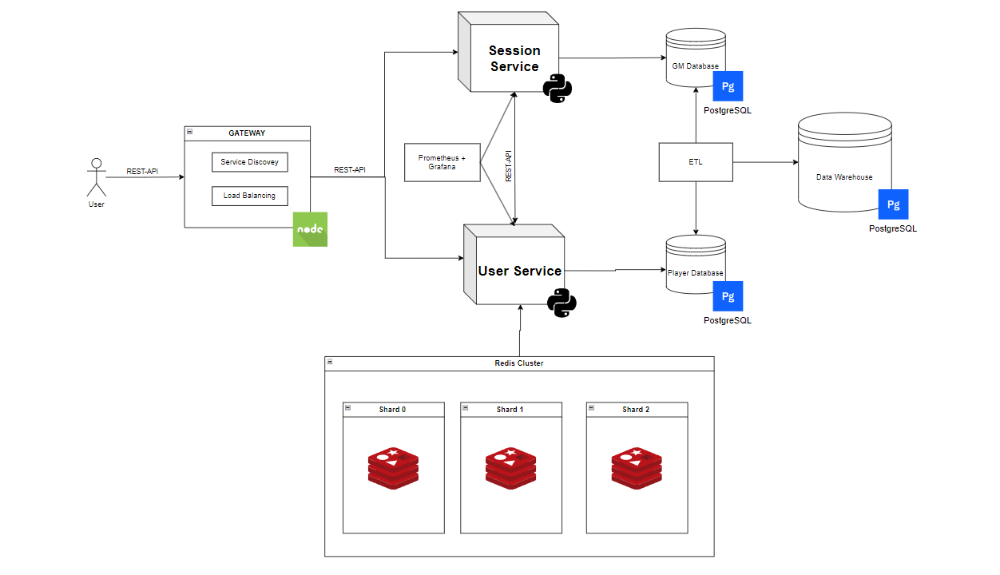

# Dungeons and Dragons online platform :dragon_face:
#### made by Vlad Ursu,  FAF-212

<br>

## Intro
D&D has been a window into social interactions for many a nerd since the distant ages of the 1970s, and now using the tools invented by the very same nerds, the D&D experience can expand far beyond a single physical tabletop.

With the arcane arts of microservices, we can create a scalable, easily maintainable, and fault-tolerant online platform, bringing a new dimension to the classic game.

## Assesing suitability
1. **Modular game logic:** The whole D&D game process is already modularized, as it easily separates between: Game Master and the Players themselves, thus creating a service to handle each part of the game is a logical follow-up.

2. **Scalability:** Part of the game such as campaign making, character creation/registration, or ongoing matches may have different loads. Microservices would make possible scaling each component independetly, thus  assuring an optimal resource allocation.

3. **Resilience:** If one service, or instance of a service goes down, the game will not be affected, and the problem will be dealt with quetly, minimizing any disruptions.

4. **Easily updated/expanded:** It is easier to implement new features (such as rules, or creatures, or a whole new edition of D&D) in a microservice architecture.

## Similar products

Most online multiplayer games (League of Legends, Fortnite, etc) use an architecture based on matchmaking, and creating a new child instance of the service for each game session.

## Service Boundaries
The two services in this architecture can be defined as such: 
- **Authentication Service**

This service would be responsible for player authentication, character creation, customization, etc.

- **Game Session Service**

This service will be responsible for handling each game session, combat, NPCs, etc.


## Technology stack & Communication Patterns

- Python (Flask) - for writing the 2 services.
- Node.js - for the Gateway, the Service Discovery and Load Balancing.
- MongoDB - for the service databases.
- Redis - for the shared service cache.

The microservices are communicating between themselves synchronously using REST-APIs, and asynchronously when it comes to caching in the redis db, and load balancing.

Additionally the user will employ websockets for real time communication.

## Data Management

### Authentication API Endpoints

- ```(POST) api/auth/register```: used for registering a new player.

```
Request:
{
  "username": "string",
  "email": "string",
  "password": "string"
}

Response:
{
  "user_id": "string",
  "message": "Registration successful"
}
```

---

- ```(POST) api/auth/create-session```: Create a new character sheet.

```
Request:
{
  "user_id": "string",
  "character_name": "string",
  "character_class": "string",
  "character_race": "string",
  "starting_stats": {
    "strength": "int",
    "dexterity": "int",
    "intelligence": "int",
    "wisdom": "int",
    "charisma": "int"
  }
}

Response:
{
  "character_id": "string",
  "message": "Character created successfully"
}

```

- ```(POST) api/auth```: Account authentication.

```
Request:
{
  "email": "string",
  "password": "string"
}

Response:
{
  "user_id": "string",
  "message": "Login successful"
}

```

---

- ```(POST) api/auth/player{character_id}```: Used for returning a player's info.

```
Response:
{
  "character_id": "string",
  "character_name": "string",
  "character_class": "string",
  "character_race": "string",
  "stats": {
    "strength": "int",
    "dexterity": "int",
    "intelligence": "int",
    "wisdom": "int",
    "charisma": "int"
  },
  "message": "Character details retrieved successfully"
}

```

---


### Game Session API Endpoints

---

- ```(POST) api/session/init```: Initialiaze a game session.

```
Request:
{
  "gm_id": "string",
  "campaign_name": "string",
  "players": [
    {
      "player_id": "string",
      "character_id": "string"
    },
    ...
  ]
}

Response:
{
  "session_id": "string",
  "message": "Game session initialized"
}

```

---

- ```(POST) api/session/{session_id}/npc/create```: Create an NPC for a particular session.

```
Request:
{
  "session_id": "string",
  "npc_name": "string",
  "npc_stats": {
    "strength": "int",
    "dexterity": "int",
    "intelligence": "int"
  },
  "npc_role": "string"  // Example: "villain", "merchant", etc.
}

Response:
{
  "npc_id": "string",
  "message": "NPC created successfully"
}

```

---

- ```(POST) api/session/{session_id}/combat/initiate```: Starts a combat sequence between players and NPCs.

```
Request:
{
  "session_id": "string",
  "participants": [
    {
      "character_id": "string",
      "npc_id": "string",
      "action": "attack"
    }
  ]
}

Response:
{
  "combat_id": "string",
  "message": "Combat initiated"
}

```

---
---

## Deployement and Scaling

The project is deployed using docker-compose, and the compose yml document. Each Docker container was tested using the Docker Desktop app.

## Instructions
Here’s a general instruction you could include in your `README.md` for downloading and deploying the repository with Docker Compose:

---

# Deployment Instructions

### Steps to Deploy

1. **Clone the Repository**  
   Start by cloning this repository to your local machine.
   ```bash
   git clone https://github.com/Vlad-Urs/PAD-lab-1.git
   cd <repo-dir>
   ```

3. **Build and Run Containers**  
   Use Docker Compose to build and start the application services.
   ```bash
   docker-compose up --build
   ```
   This will download the necessary images, build the containers, and start all services defined in the `docker-compose.yml` file.

4. **Accessing the Application**  
   Once the containers are up and running, you can access the application:
   - **API Endpoints**: Access APIs via `http://localhost:PORT/<endpoint>`

5. **Stopping the Services**  
   To stop the running containers:
   ```bash
   docker-compose down
   ```


## Laboratory 2 updates



1. Adapt the circuit breaker to ensure Service High Availability
2. Use Prometheus and Grafana for logging and aggregation.
3. Implement microservice-based 2 Phase Commits for an endpoint that create changes more than in one database.
4. Implement cache hashing and high availability (if won't shoot for a higher mark).
5. Update Databases by implementeing redundancy/replication and failover, as well as a Data Warehouse.